# bamazon-app

### Overview

This is a node.js command line application utilizing mySQL to store data related product inventory. The mySQL database will sotre products for sale with the sale price. It will also store the dollar amount of sales for each product. It also has functions to allow replentishment of invenotry, adding new products and departments, and displaying the sales by department.

### Before you Begin

1. In the terminal command line, go to the directory where you installed the files and type `npm install` (no quotes).  This should install the required npm packages.

2. Open the MAMP application and verify that both the Apache and MySQL servers are running.

3. Open the application of choice to create a mySQL database (e.g. MySQL Workbench) and open an existing connection (or create a new one if needed).

4. Copy all the information in the `bamazonSeeds.sql` file and paste it into the new query field.

5. Execute the entire script to create the database and seed it with initial data.

6. At the top of the index.js file the connection to the database is created. Verify the values for `port`, `user`, and `password` correspond to you specific settings.

### Running the app

1. In the terminal command line, go to the directory where you installed the files and type `node index.js` (no quotes).

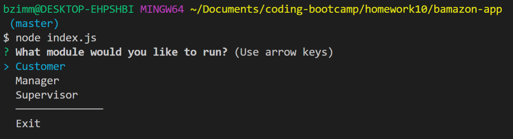

2. What module would you like to run? Selecting 'Exit' will exit the application.

#### Customer Module

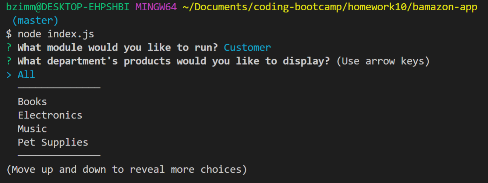

1. Select the department's products you want to display.

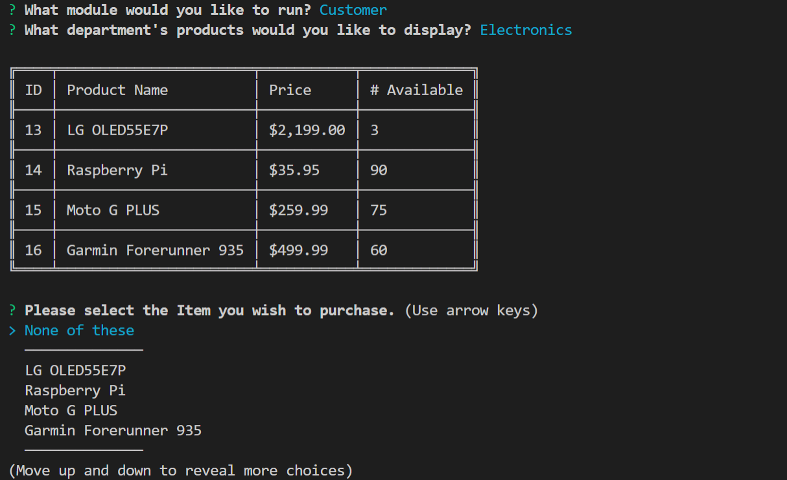

2. In this example we have selected 'Electronics'. What product would you like to purchase? Selecting 'None of these' will return you to the department selection menu.

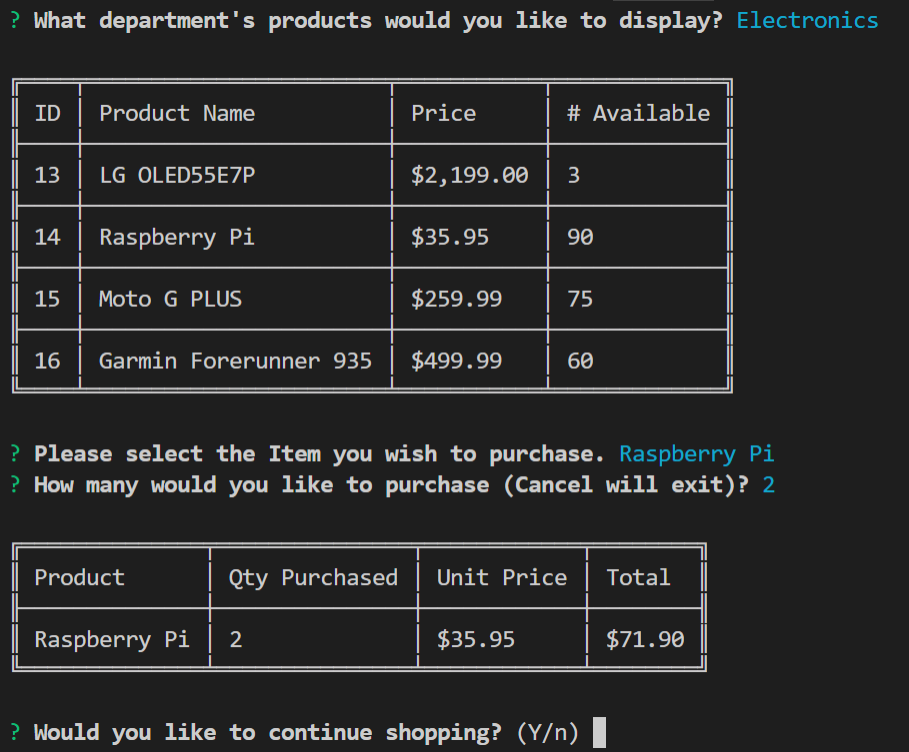

3. We have purchased 2 Raspberry Pi. Do you wish to continue shopping? Selecting 'y' will return you to the department selection menu and 'n' will exit the application entirely.

#### Manager Module

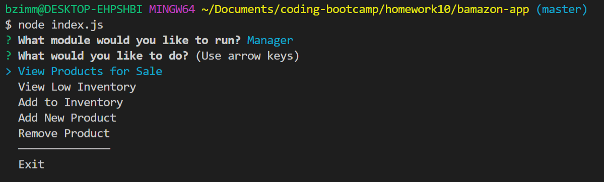

1. Select the manager function you want to perform.

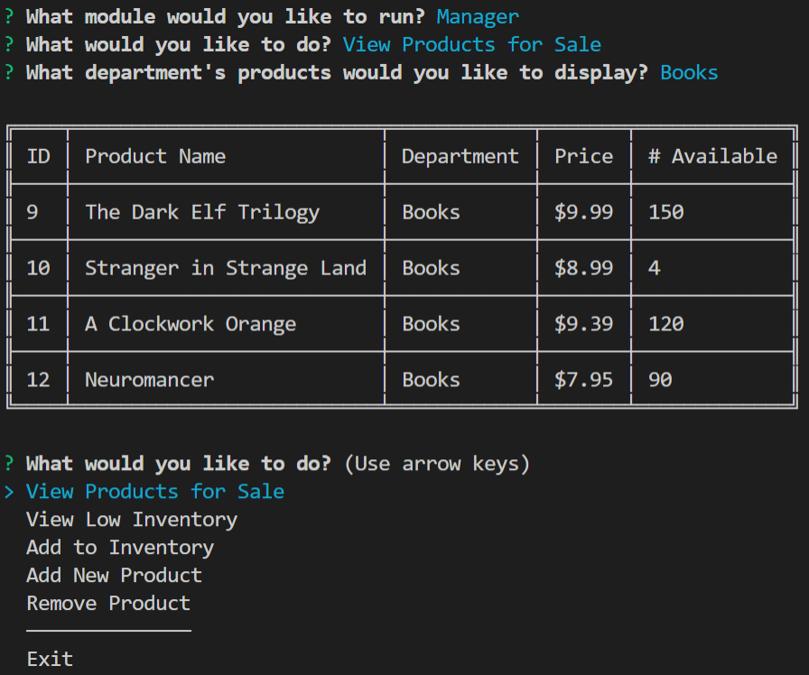

2. After selecting 'View Products for Sale', the application will ask what department's products you want to view ('All' will display all the products in the database). Here we are viewing the products for sale in the 'Books' department.

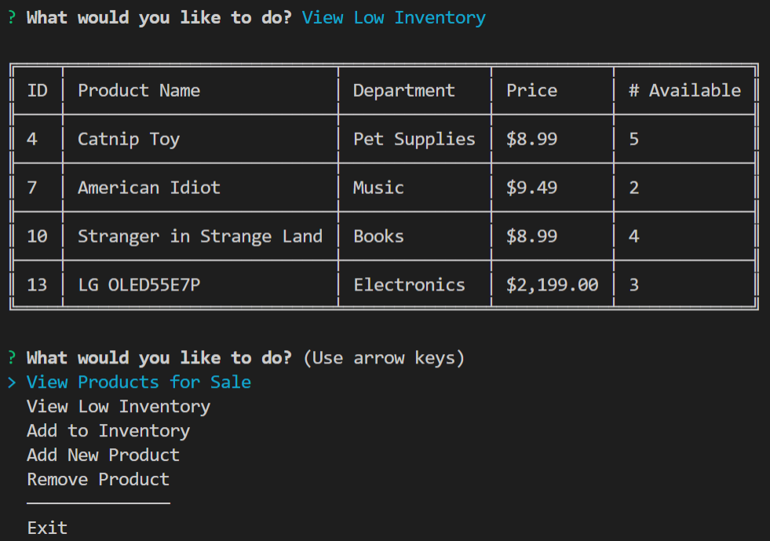

3. Selecting 'View Low Inventory' will display all the products in the database that have a quantity <= 5.

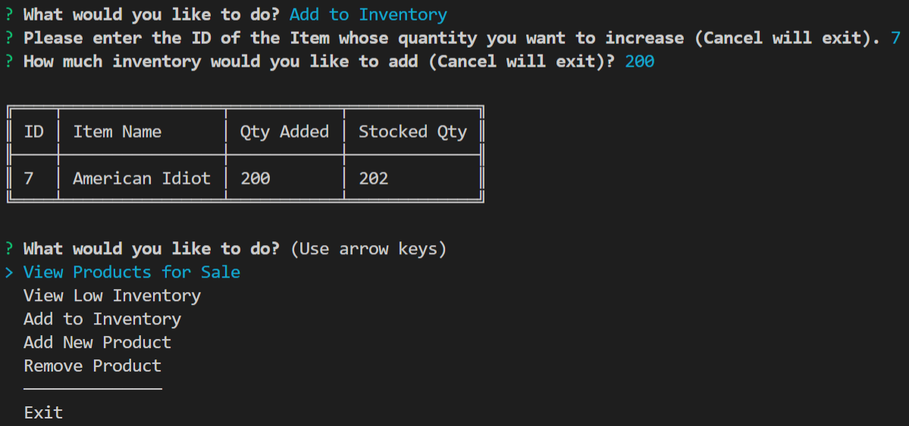

4. After selecting 'Add to Inventory', you will be asked for the ID of the product whose inventory you want to increase and then how many you want to add. Here we have added 200 items to the 'American Idiot' item.

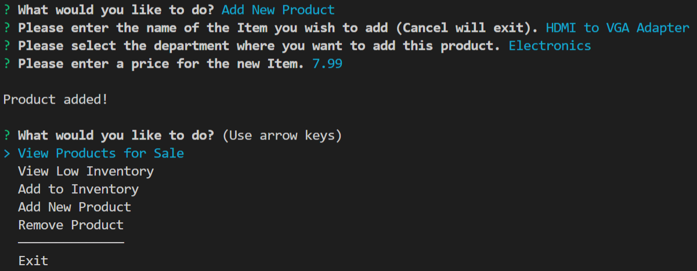

5. Selecting 'Add New Product' will cause the application to ask you for the name of the product you wish to add, the department where you want to add the product, and the price you want to sell them for. Here we have added a 'HDMI to VGA Adapter' to 'Electronics' for '7.99'.

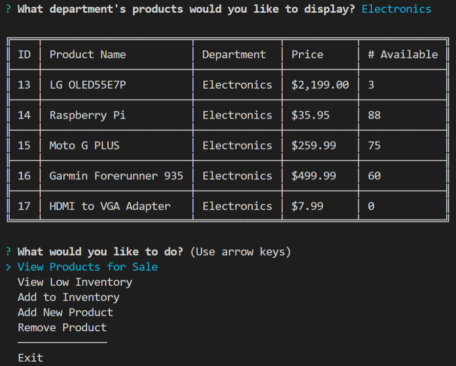

6. We can verify the product was added by selecting 'View Products for Sale' and 'Electronics'. Item 17 is the product we just added.

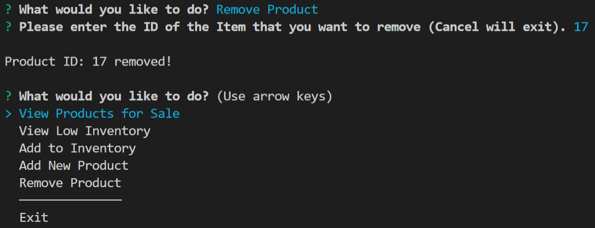

7. The final function in the Manager module is to remove a product. Here we have removed the product we just added.

#### Supervisor Module

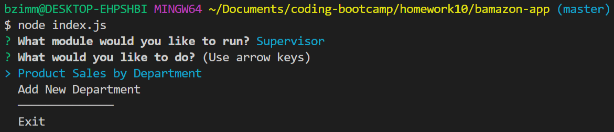

1. Select the Supervisor function you would like to perform.

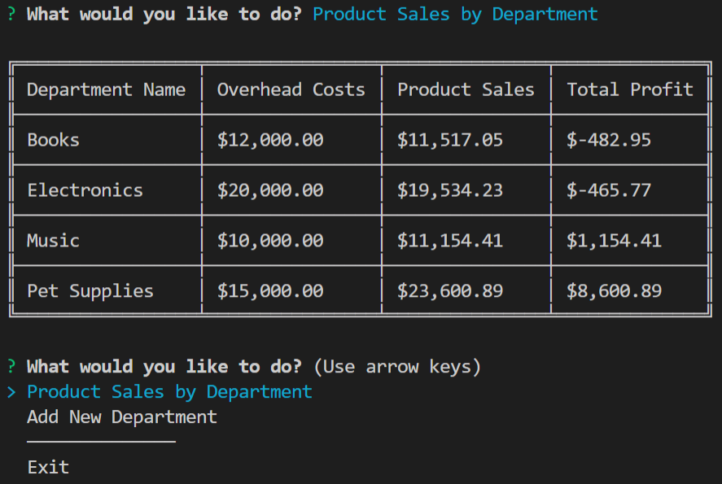

2. Selecting 'Product Sales by Department' will sum all the revenue generated by selling the individual products for each department. It also calculates the profit by subtracting the department overhead from the sum of the revenue.

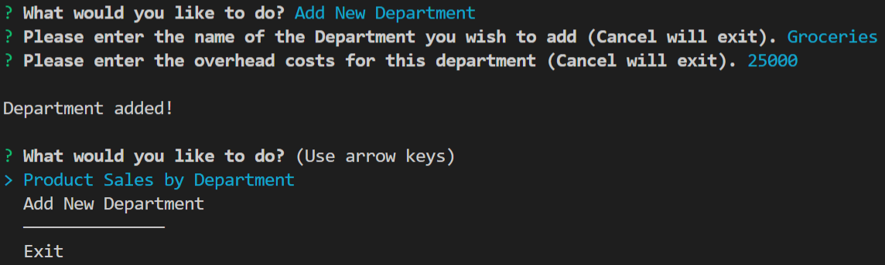

3. Selecting 'Add New Department' will cause the application to ask you the name of the department you want to add and the overhead costs for that department. Here we have added a department named 'Groceries'.

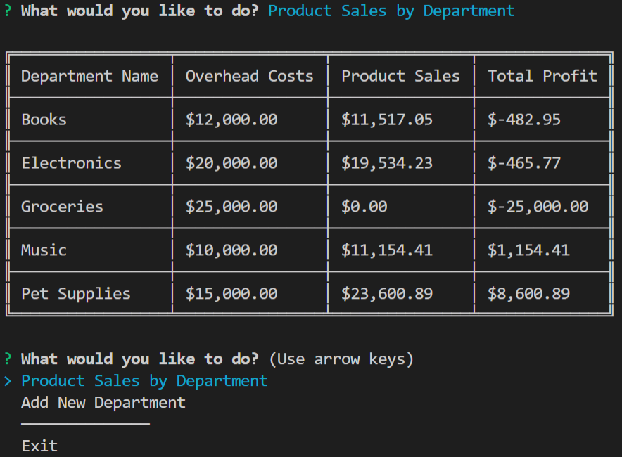

4. We can verify the department was added by selecting 'Product Sales by Department'. 'Groceries' was indeed added, but has $0.00 sales (no products have been added and consequently no sales have been generated for that department).